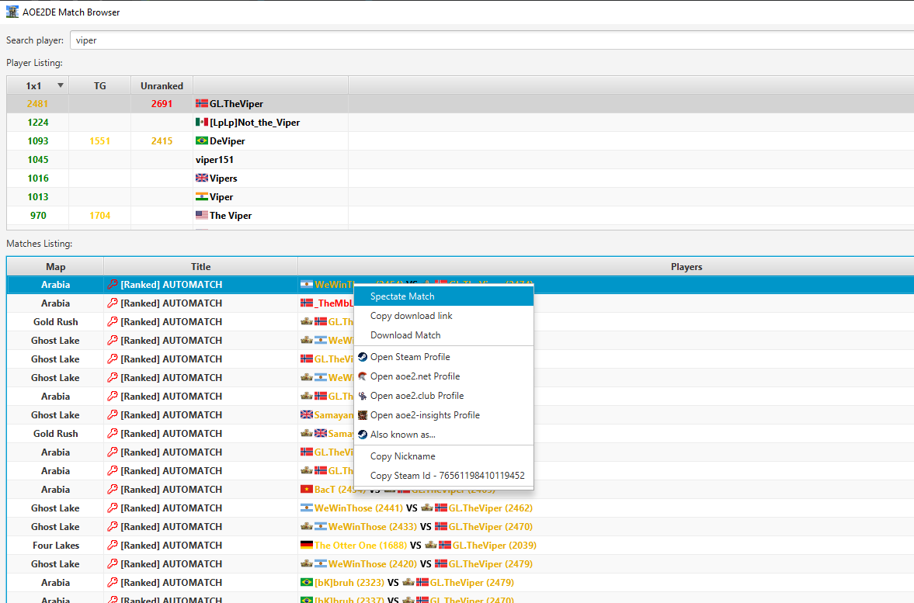

# AOE2DE Match Browser

A desktop application allowing to easily search for players and their stats, download matches and spectate games.

## Spectating Games

Quite often getting to spectate a game can be troublesome -- for some reason the match is not visible in the in-game spectator tab,
and it may also not be visible on AOE2.net's "On-Going Matches" tab. 

The "Spectating Games" feature overcomes the problem
by checking what's a player's latest match and directly spectating through its id, a method that should be far more dependable.

## Downloading Recorded Games

Most often people use aoe2.net to download recorded games by looking at a given player's match history.

Unfortunately, after the game is finished, it may take some 20-60 mins for them to be visible on the site. 
AOE2 Match Browser allows you to have them ready for download right away.

## See Players Without Nicknames

There are players that aren't "clickable" on aoe2.net as their nicknames seem to be empty. In this tool, they show up as `<blank>`.
